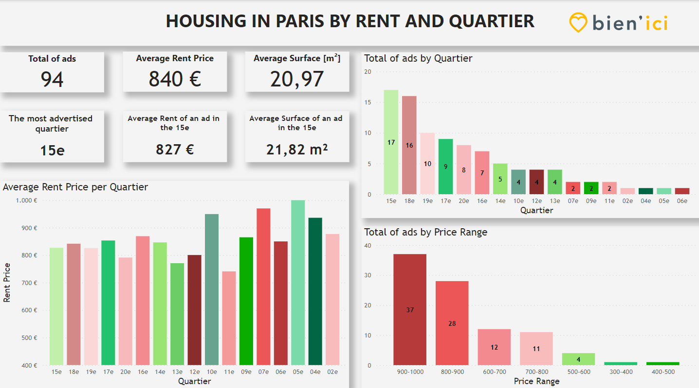
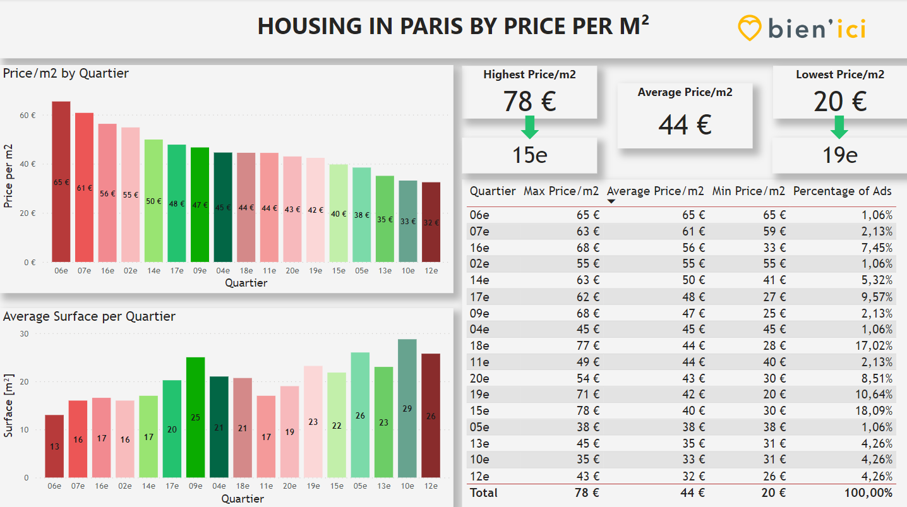

# Housing in Paris

## Description

The goal of this project was to use **Python** to collect, explore and manipulate data about something which is of great interest to me: housing information in Paris. I took upon me the challenge of doing a **WebScraping** onto the rental listing site **BienIci**.

I used **Python**, especially the packages <b/>BeautifulSoup<b/> and <b/>Pandas<b/>, to do a **WebScraping** of the housing information in Paris. After collecting the data, I used **Pandas** to **explore and manipulate the usable information** and, with the help of the dataframes, I could store and export all the information to a csv file. This csv file was used in the **Power BI** software in order to better **visualize** the collected data.

## Softwares

- Python
- Power BI

## Code

In order to not pollute this repository, I left the program used in the repository files, which I invite you to take a look. The jupyter notebook file presents you with the code and the direct results, which could be a bit overwhelming, so I also made the python file available, which only presents the code.

## Power BI results

 

